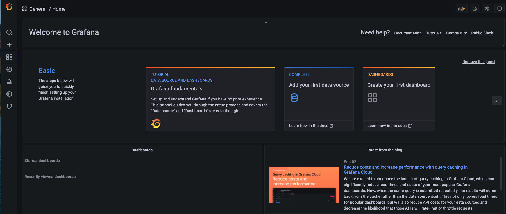
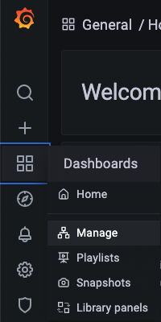
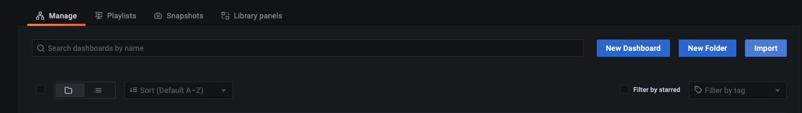
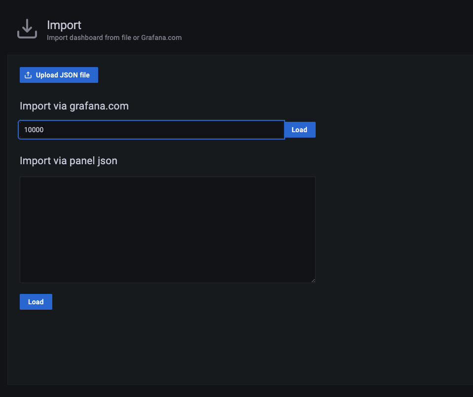
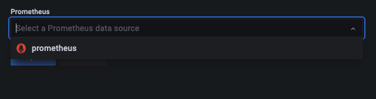
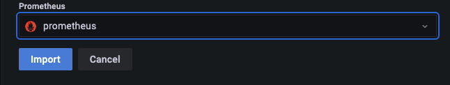
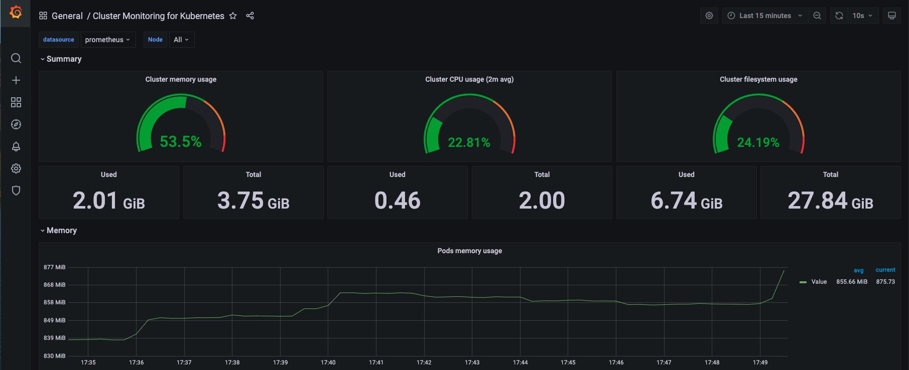
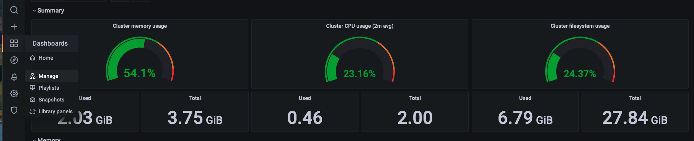
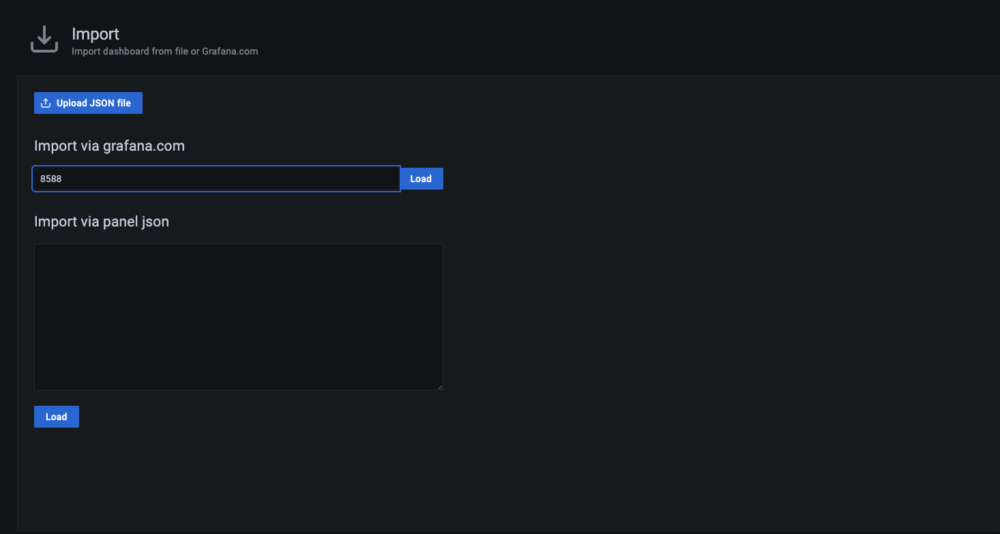
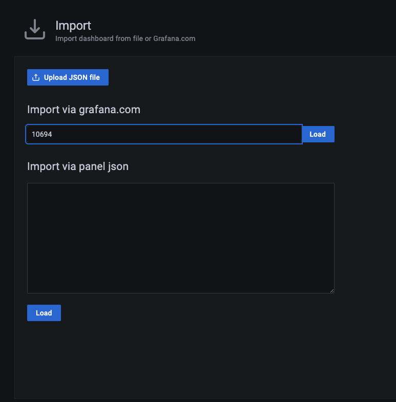

## Prometheus, kube-state-metrics, Metrics Server, Grafana Example

### 1. Create a namespace

Let's start by creating a new namespace, where our Prometheus resources will live:

```bash
kubectl create namespace monitoring
```

### 2. Create the monitoring resources

```bash
cd ./prometheus/monitoring-resources
```

```bash
kubectl create -f ./ -R
```

This will deploy in our cluster: `kube-state-metrics`, `Grafana`, and `Prometheus`

```
configmap/grafana-datasources created
deployment.apps/grafana created
service/grafana created
clusterrolebinding.rbac.authorization.k8s.io/kube-state-metrics created
clusterrole.rbac.authorization.k8s.io/kube-state-metrics created
deployment.apps/kube-state-metrics created
serviceaccount/kube-state-metrics created
service/kube-state-metrics created
service/prometheus-service created
deployment.apps/prometheus-deployment created
clusterrole.rbac.authorization.k8s.io/prometheus created
clusterrolebinding.rbac.authorization.k8s.io/prometheus created
configmap/prometheus-server-conf created
```

If we run:

```bash
kubectl get all -n monitoring
```

We must get something similar to:

```
NAME                                         READY   STATUS    RESTARTS   AGE
pod/grafana-6cb5cf45bf-zjs2n                 1/1     Running   0          2m47s
pod/prometheus-deployment-599bbd9457-h2xhh   1/1     Running   0          2m46s

NAME                         TYPE       CLUSTER-IP       EXTERNAL-IP   PORT(S)          AGE
service/grafana              NodePort   10.111.184.114   <none>        3000:32000/TCP   2m47s
service/prometheus-service   NodePort   10.96.101.225    <none>        9090:30000/TCP   2m46s

NAME                                    READY   UP-TO-DATE   AVAILABLE   AGE
deployment.apps/grafana                 1/1     1            1           2m47s
deployment.apps/prometheus-deployment   1/1     1            1           2m46s

NAME                                               DESIRED   CURRENT   READY   AGE
replicaset.apps/grafana-6cb5cf45bf                 1         1         1       2m47s
replicaset.apps/prometheus-deployment-599bbd9457   1         1         1       2m46s
```

### 3. Inspect Prometheus on host

If you're running `Kubernetes on Docker Desktop`, you can find `Prometheus` on `http://localhost:30000`.

If instead you are using `minikube`, to find the url run:

```bash
minikube service --url prometheus-service -n monitoring
```

* Let's try out `Prometheus`:
    1. Click on `Graph` tab, and start typing on search box.
    2. Select a metric from drop-down - `kubelet_running_pods`, for example
    3. Click `Execute`
    4. We can switch between `Graph` and `Table` views

### 4. Set up Grafana

If you're running `Kubernetes on Docker Desktop`, you can find `Grafana` on `http://localhost:32000`.

If instead you are using `minikube`, to find the url run:

```bash
minikube service --url grafana -n monitoring
```

With Grafana open on host, on a browser:

1. Login with `admin` and `admin` for the username and password. You can reset the password on the next screen or click `Skip`.

2. On the `Welcome to Grafana`, on left aside `menu`, select `Dashboards icon`



3. From here, select `Dashboard` -> `Manage`.



4. Click on `Import`



5. Enter an ID value of `10000` into the `Grafana.com Dashboard` textbox and click `Load`. This will load the `Cluster Monitoring for Kubernetes` dashboard.



    
>Note: You can find a list of pre-configured dashboards at https://grafana.com/grafana/dashboards. Each one will have an id you can copy into the Grafana `Import dashboard` screen.

6. On the next screen you'll see a `Select a Prometheus data source` drop-down. Select `prometheus` from the list and click `Import`. Your dashboard will now load.







7. Click on the `Dashboard` -> `Manage`. 



8. Go back through the steps to import a dashboard but this time enter an ID of `8588`. This will load the `Kubernetes Deployment Statefulset Daemonset metrics` dashboard.



9. If you click on the dashboard name drop-down in the upper-left corner of the screen you'll see both of your dashboards listed and can now switch between them.

10. Import the dashboard with an ID of `10694`. This dashboard is called `Container Statistics`. 



From here you can load other dashboards or create your own.

**NOTE**: The Metrics Server YAML has been modified to enable it to run in more simple Kubernetes scenarios like Docker Desktop. Details about the modifications made can be found at https://blog.codewithdan.com/enabling-metrics-server-for-kubernetes-on-docker-desktop. You'll want to remove the `--kubelet-insecure-tls` arg in `metrics-server/kubernetes/metrics-server-deployment.yaml` for more real-world scenarios.

**NOTE**: To enable metrics-server on minikube, run: `minikube addons enable metrics-server`

## Clean up

To remove all of the monitoring resources run:

```bash
kubectl delete -f ./ -R
```

If you are using `minikube` you can disable `metrics-server` by running:

```bash
minikube addons disable metrics-server
```

## References

Get more details on Prometheus at https://prometheus.io/docs/prometheus/latest/getting_started and https://devopscube.com/setup-prometheus-monitoring-on-kubernetes.

A list of Pod Metrics provided by kube-state-metrics can be found at https://github.com/kubernetes/kube-state-metrics/blob/master/docs/pod-metrics.md. 

Another option for getting Prometheus going using only Docker Compose and Docker Swarm can be found at:

https://github.com/vegasbrianc/prometheus

The yaml files used here were originally created by Bibin Wilson (thanks for the great work Bibin!) and documented at:
- https://devopscube.com/setup-prometheus-monitoring-on-kubernetes
- https://devopscube.com/setup-kube-state-metrics
- https://devopscube.com/setup-grafana-kubernetes/

[kube state metrics GitHub](https://github.com/kubernetes/kube-state-metrics)
