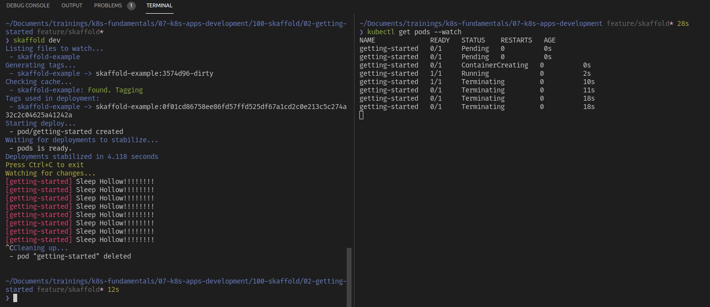

# Getting started

## Prerequisites

* Docker
* minikube
* kubectl
* Skaffold

## Steps

### 1. Create the application file

Create `main.go` and place it on root directory solution

```go
package main

import (
	"fmt"
	"time"
)

func main() {
	for {
		fmt.Println("Hello World!")

		time.Sleep(time.Second * 1)
	}
}
```

### 2. Create Dockerfile

Create `Dockerfile` and place it on root directory solution

```Dockerfile
FROM golang:1.15 as builder

COPY main.go .

# `skaffold debug` sets SKAFFOLD_GO_GCFLAGS to disable compiler optimizations
ARG SKAFFOLD_GO_GCFLAGS
RUN go build -gcflags="${SKAFFOLD_GO_GCFLAGS}" -o /app main.go

FROM alpine:3
# Define GOTRACEBACK to mark this container as using the Go language runtime
# for `skaffold debug` (https://skaffold.dev/docs/workflows/debug/).
ENV GOTRACEBACK=single
CMD ["./app"]
COPY --from=builder /app .
```

### 3. Create Skaffold manifest

Create `skaffold.yaml` and pace it on root directory solution

```yaml
apiVersion: skaffold/v2beta24
kind: Config
build:
  artifacts:
  - image: skaffold-example
deploy:
  kubectl:
    manifests:
      - k8s-*
```


### 4. Create deployment manifest

```yaml
apiVersion: v1
kind: Pod
metadata:
  name: getting-started
spec:
  containers:
    - name: getting-started
      image: skaffold-example
```

### 5. Continous build & deploy on code changes

Now we're ready to run `skaffold dev`, when ever we change our base code, the image will be built and deployed into our local cluster `minikube` in this case.

```bash
skaffold dev
```

We get something similar to this:




Another important file to mention is `skaffold.yaml`, this manifest provides specifications on the workflow, in this case the pipeline will be as follows:

* Building a Docker image from source using the Dockerfile
* Tagging the Docker image with the `sha256` hash of its contents
* Updating the K8s manifest, `k8s-pod.yaml`, to use the image built previously 
* Deploying the Kubernetes manifest using `kubectl apply -f`
* Streaming the logs back from the deployed app

### 6. Updating our code

Now when ever we make a change in our code we can see the changes, let's update `main.go`:

```diff
package main

import (
	"fmt"
	"time"
)

func main() {
	for {
-	  fmt.Println("Hello World!")
+ 	fmt.Println("Spooky Hollow!")

		time.Sleep(time.Second * 1)
	}
}
```

We get the following output:

```bash
[getting-started] Spooky Hollow!
```

For last if we want to build and deploy once we can use `skaffold run`. If we run the previous command, and then run:

```bash
kubectl decribe pod getting-started
```

We will find out the image that Skaffold has created for us:

```
IPs:
  IP:  172.17.0.4
Containers:
  getting-started:
    Container ID:   docker://4973a9d13e5598805a50a9b1928e891321bdbb0a951d8e497bb9dadf2e5b7d65
    Image:          skaffold-example:c916a39cd172f8cf0c2f2427b1cb0f9f991b788613002a74ca367dfb67266e9c
```


## References

[Quickstart](https://skaffold.dev/docs/quickstart/)
