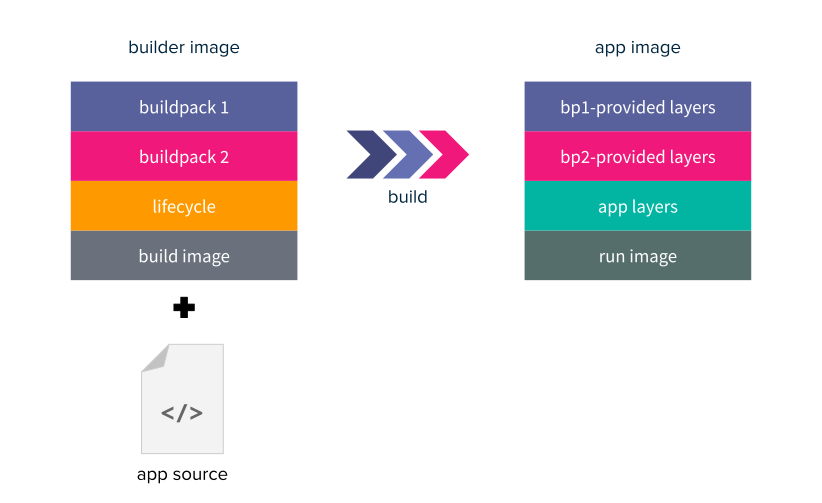

# Buildpacks

A buildpack is a unit of work that inspects your app source code and formulates a plan to build and run your application.

Buildpacks allow you to convert your source code into a secure, efficient, production ready OCI (Open Container Initiative) image. Buildpacks examine your apps to determine all the dependencies it needs and configure them appropriately to run on any cloud.

## How do they work?
2 phases per buildpack:
- **Detect phase**: it runs against the source code to determine if the buildpack is applicable or not. If a buildpack is detected to be applicable, it proceeds to the build phase. If no buildpack is applicable, the build phase is skipped. **EXAMPLES**:
    - A Python buildpack may look for a `requirements.txt` or a `setup.py` file to pass.
    - A Node buildpack may look for a `package-lock.json` file to pass.
- **Build phase**: it also runs against the source code to:
    - Set up the build-time and run-time environment.
    - Download dependencies and compile the source code (if needed).
    - Set appropriate entry point and startup scripts.
**EXAMPLES**:
    - A Python buildpack may run `pip install -r requirements.txt` if it detected a `requirements.txt` file.
    - A Node buildpack may run `npm install` if it detected a `package-lock.json` file.

## What is a builder?
A builder is **an ordered combination of buildpacks** with a base build image and a run image.



- It takes in the app source code and **builds the output app image**.
- **The build image provides the base environment for the builder** (for eg. an Ubuntu Bionic OS image with build tooling)
- **The run image provides the base environment for the app image during runtime**.
- A combination of a build image and a run image is called a **stack**.
- Under the hood a builder makes use of a mechanism called **lifecycle**. This lifecycle runs orderly the detect phase for all the buildpacks it contains. Then, it proceeds to run the build phase of all the buildpacks that passed detection.
- This allows to have a **single builder** that can detect and build various kinds of applications automatically.

**EXAMPLE**: let's say a builder contains the Python and Node buildpacks. Then:
- If app source just has a `requirements.txt`, the builder will only run the Python build steps.
- If app source just has a `package-lock.json`, the builder will only run the Node build steps.
- If app source has both `package-lock.json` and `requirements.txt`, the builder will run both the Python and Node build steps.
- If app source has no related files, the builder will fail to detect and exit.

## Which tools are needed?
- **pack**: `pack` is an implementation of the Cloud Native Buildpacks Platform Specification. It supports the use of buildpacks and makes use of Docker. It also enables the following functionality:
    - Build and application using buildpacks.
    - Rebase application images created using buildpacks.
    - Creation of various components used within the ecosystem.
- **Docker**: to store all the images that will be built.

### How to install `pack`
This tool works as both a CLI and a Go library.
- **CLI**: `pack` can be installed in Linux, macOS and Windows. Please check this [link](https://buildpacks.io/docs/tools/pack/#install) to figure out how to install `pack` according to your OS. For instance, On Ubuntu you can follow the following commands:
```bash
$ sudo add-apt-repository ppa:cncf-buildpacks/pack-cli
$ sudo apt-get update
$ sudo apt-get install pack-cli
```
- **Go library**: `go get -u github.com/buildpacks/pack`


## References

[Buildpacks documentation](https://buildpacks.io/docs/)
