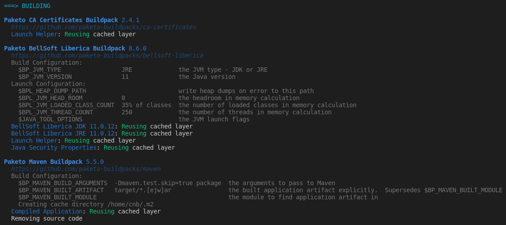

# Salary service migration

In this example we are going to migrate `salary` service (from [99-code-example](../../99-code-example/graalvm/salary)) to use `buildpacks`.

## Steps
1. Copy all the content of [salary service folder](../../99-code-example/graalvm/salary) into a new directory named `salary-buildpacks`.
2. Delete Docker files since they are not needed anymore: `Dockerfile` & `.dockerignore`.
3. **Select a builder**. To build an app it is necessary to decide which builder is to be used. When using `pack` it is possible to execute a command to retrieve a list of suggested builders: `pack builder suggest`.
4. **Build the app**. Now that the builder has been chosen, it's time to build the app:
```bash
$ pack build jtrillo/salary-buildpacks --path salary-buildpacks/ --builder paketobuildpacks/builder:base
```
5. **Run the container**
```bash
$ docker run -d -p 8080:8080 --name pruebas-buildpacks jtrillo/salary-buildpacks
```
6. OPTIONAL. **Push the image** to a container registry such as Docker Hub: `docker push jtrillo/salary-buildpacks`

### Inspecting the JVM version
The exact JRE version that was contributed to a given image can be read from the Bill-of-Materials.
```bash
$ pack inspect-image jtrillo/salary-buildpacks --bom | jq '.local[] | select(.name=="jre") | .metadata.version'
> "11.0.12"
```

### Installing a Specific JVM version
The following environment variables configure the JVM version at build-time
- `BP_JVM_TYPE`: it can be **JDK** or **JRE**
- `BP_JVM_VERSION`: the Java version

The next screenshot show what is displaying during build-time:

As it can be seen, all the environment variables that can be used on each buildpack.