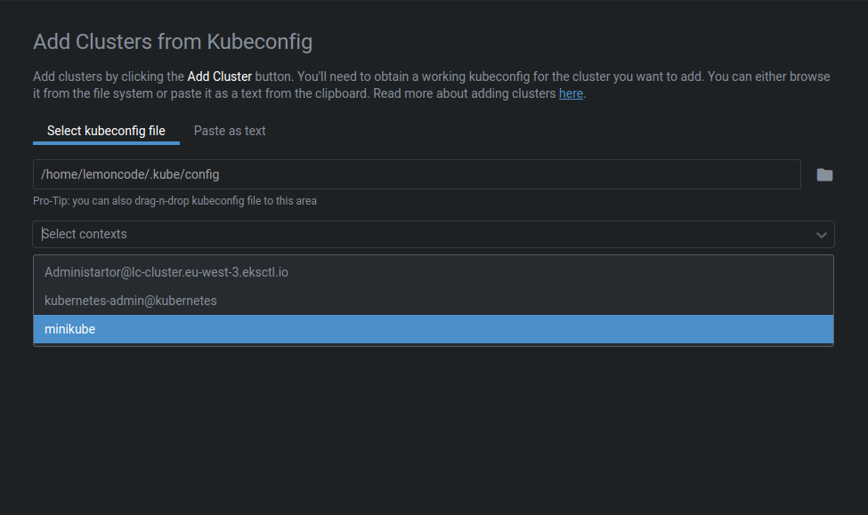
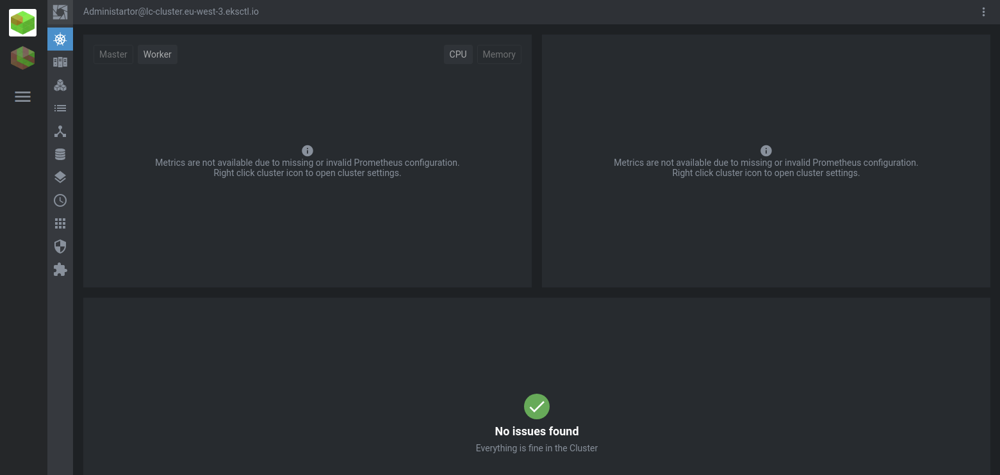
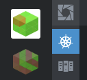
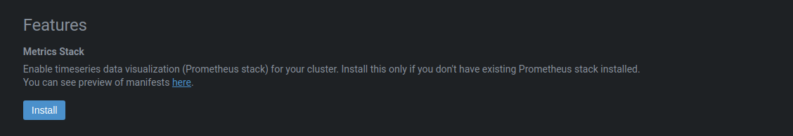
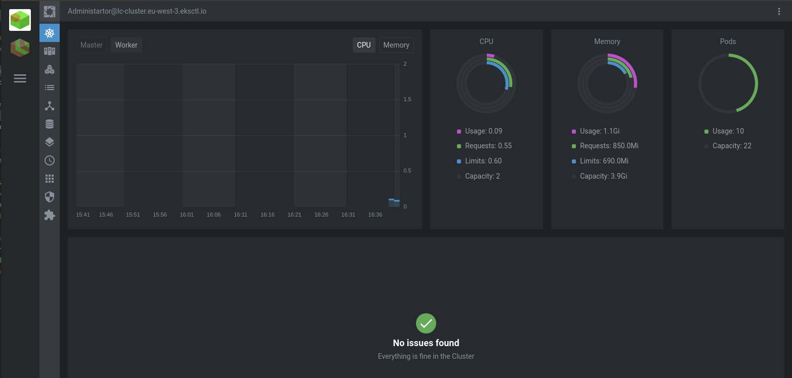

# Adding a Cluster

We can click on plus button a new dialog appears for us:

Notice that we can select multiple clsuters on this dialog, select `EKS` and `minikube`.

And click `Add Clusters`, if everything goes fine, we must see a green sncak bar saying that everything it's ok.

Close this window with `X` button.

Select the `EKS` cluster, this will move to a list with the clusters that we selected:

We can notice that now resource is being displayed, this is because on the cluster `Prometheus` is not being enabled yet.

Right click button on the selected cluster:

And scroll down, untill you see `Features`

And click on `Install`. After installing we can go back to the main screen closing the current window, by clicking `X` button.

From here we can select different options on the left side menu:

* Nodes
* Workloads
* Configuration
* Network
* Storage
* Namespaces
* Events
* Apps
* Access Cotrol
* Custom Resources