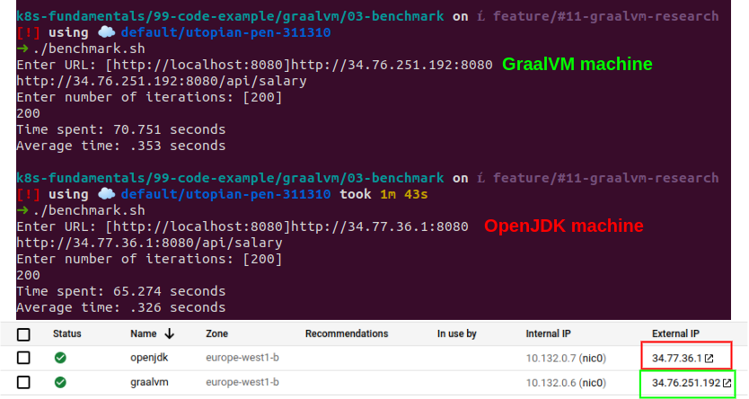

# Benchmark

A simple comparision has been carried out between a VM using GraalVM and other one with OpenJDK.

## The code
The script used for benchmarking is [benchmark.sh](./benchmark.sh).
```bash
$ chmod +x benchmark.sh
$ ./benchmark.sh
```

## VMs details
- OS: Ubuntu 18.04.1 LTS
- CPU: Intel(R) Xeon(R) CPU @ 2.30GH
- Memory: 4,5GB

## GraalVM machine
Check folder _01-local_ [README.md](../01-local/README.md#installing-graalvm) file to discover how to prepare the VM.

## OpenJDK machine
Configuration is quite simple, since only OpenJDK is necessary. Steps to follow are written below:
```bash
$ sudo apt update
$ sudo apt install default-jdk
```

Checking Java installation:
```bash
$ java --version
> openjdk 11.0.11 2021-04-20
> OpenJDK Runtime Environment (build 11.0.11+9-Ubuntu-0ubuntu2.18.04)
> OpenJDK 64-Bit Server VM (build 11.0.11+9-Ubuntu-0ubuntu2.18.04, mixed mode, sharing)
```

## Results
The next picture shows the time spent making a total of 200 request to salary API in both VMs.



As we can see, the difference between both approaches is not relevant (even OpenJDK had a bit better result). Next steps for further testing:
- Increasing the total number of requests
- Implementing a new API resource more complex in order to make use of the virtues of GraalVm